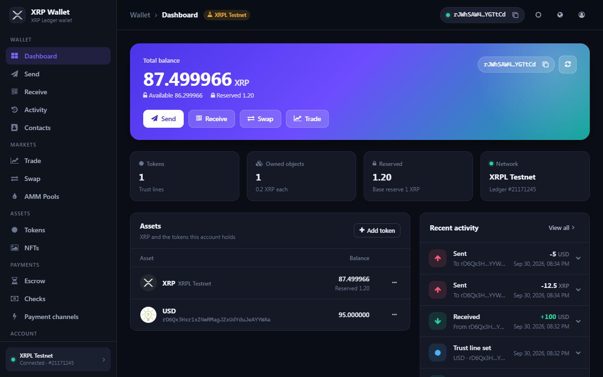
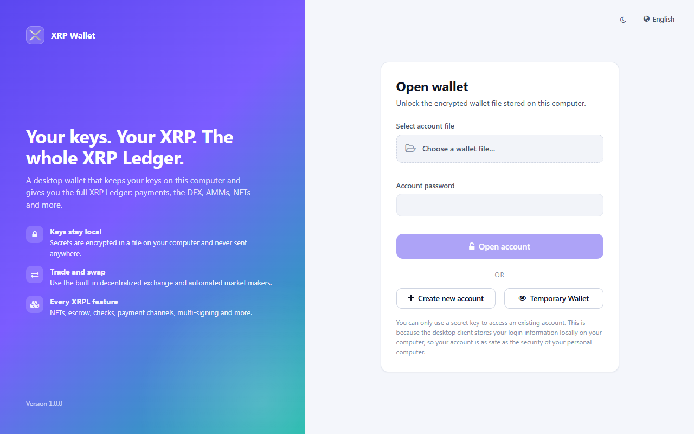
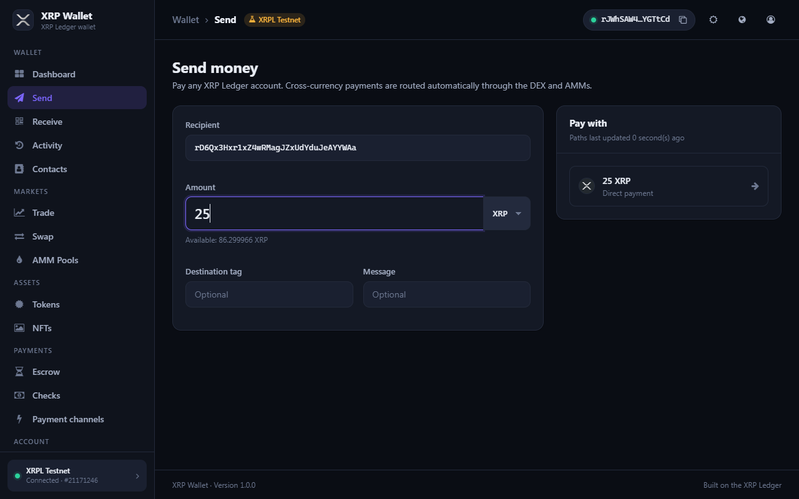
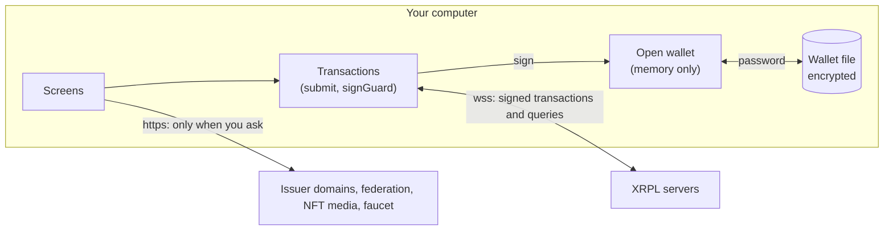

# XRP Wallet

A desktop wallet for the [XRP Ledger](https://xrpl.org) on Windows, macOS and Linux. Your keys stay
on your computer, in a wallet file encrypted with your password, and the app collects no data.

> **Beta.** XRP Wallet is new open-source software. Try it on the Testnet first (see
> [Testnet and Mainnet](#testnet-and-mainnet)), keep your recovery phrase backed up on paper, and use
> it at your own risk.

| | |
|---|---|
|  |  |

[中文说明](#xrp-wallet-钱包)

## Features

- **Your keys, locally.** No registration or accounts. The secret key and recovery phrase are stored
  only in a wallet file encrypted with your password, and transactions are signed on your computer.
- **Private by design.** No analytics, tracking or telemetry. [PRIVACY.md](PRIVACY.md) lists every
  connection the app makes.
- **Payments.** Send and receive XRP and tokens, with contacts, X-addresses, destination tags,
  messages and automatic cross-currency paths.
- **Trading.** Swap currencies, trade on the DEX order book, and create, deposit into, withdraw from,
  vote on and bid in AMM pools.
- **NFTs.** Mint, burn, buy, sell, transfer and broker NFTs.
- **Escrow, checks and payment channels.**
- **Account settings.** All AccountSet flags, regular key, multi-signing, deposit authorization,
  tickets, DID, and token issuer tools (transfer fee, tick size, NFT minter, clawback).
- **Tokens.** Manage trust lines, including lookup via an issuer's `xrp-ledger.toml`.
- **Activity.** A readable history of every transaction, with filters.
- Light and dark themes; English, Chinese and Japanese.
- Mainnet, Testnet (with faucet), Devnet and custom servers.
- [Federation protocol](https://github.com/ripplefox/ripplewallet/wiki/Federation-Protocol) support.

> **Back up your secret key too.** XRP Wallet turns a recovery phrase into an account the same way as
> the original RippleFox client, which is different from most other XRPL wallets: the same phrase
> opens a different account there. Your secret key (starting with `s`, under Security and backup)
> works in any XRPL wallet.

## Download

Get the installer for your system from the [Releases](../../releases) page:

| System | File |
|---|---|
| Windows | `XRP-Wallet-<version>-win-x64.msi` (or the portable `.zip`) |
| macOS | `XRP-Wallet-<version>-mac-arm64.dmg` (Apple Silicon) or `-mac-x64.dmg` (Intel) |
| Linux | `xrp-wallet_<version>_amd64.deb`, `XRP-Wallet-<version>-x86_64.AppImage` or the `.tar.gz` |

Check the download against `SHA256SUMS.txt` from the same release, for example
`Get-FileHash <file>` on Windows or `sha256sum <file>` on Linux and macOS.

Each installer also has a signed build attestation, which proves it was built by this repository's
release workflow from the tagged source and not changed afterwards. With the
[GitHub CLI](https://cli.github.com), run `gh attestation verify <file> --repo <owner>/<repo>`,
using this repository's owner and name.

The installers aren't code-signed yet. Windows SmartScreen shows "unknown publisher" (choose
**More info → Run anyway**), and on macOS right-click the app and choose **Open** the first time.

## Testnet and Mainnet

**Mainnet** is the real XRP Ledger: its XRP and tokens have real value. The **Testnet** and
**Devnet** are separate ledgers for testing, with free test XRP from a faucet. They are reset now and
then, so don't rely on balances or accounts there.

To try the app without real funds:

1. Create or open a wallet. The same wallet and address work on every network, but each network has
   its own balances.
2. Go to **Settings → Network**, choose **XRPL Testnet** (or **XRPL Devnet**) and click **Save**. The
   wallet stays open and reconnects.
3. While you're not on Mainnet, the top bar shows a yellow badge with the network's name.
4. On the dashboard, a new account shows "This account is not activated yet". Click
   **Fund from faucet** to get test XRP.

To go back, choose **XRPL Mainnet** in the same place; the badge disappears. Check it before sending
real funds.

Under **Settings → Network** you can also replace a network's servers with your own, for example a
local `rippled` node, or choose **User defined** for another XRPL-compatible network. Remote servers
must use `wss://`; plain `ws://` is only allowed to a node on your own computer.

## How it works

XRP Wallet is a React app running in [NW.js](https://nwjs.io), a desktop window based on Chromium.
Everything that involves your keys happens on your computer:

1. **Wallet file.** Your secret key, recovery phrase and contacts are stored in a file you choose,
   encrypted with your password (AES-256-CCM, PBKDF2-HMAC-SHA256 with 600,000 iterations).
2. **Open wallet.** The decrypted data is kept in memory only, never in browser storage or other
   files, until you log out, close the app or it locks itself after a period without activity.
3. **Signing.** Every transaction goes through one function, `submit()` in `src/xrpl/api.ts`. The
   server fills in the fee, sequence number and expiry; the app checks that nothing else changed and
   that the fee is within its limit (0.2 XRP, or the owner reserve for account deletion and AMM
   creation), then signs on your computer. Only the signed transaction is sent.
4. **Network.** The app talks to XRPL servers over encrypted websockets. It makes other requests
   only when you ask for them; [PRIVACY.md](PRIVACY.md) lists every connection.

### Security boundaries

- **Trusted: your computer and this app's code.** If your computer is compromised (malware, a
  keylogger, someone using your unlocked session), no wallet can protect you.
- **Not trusted: XRPL servers.** A server could report wrong fees, paths or balances. The app checks
  what the server fills in before signing, caps the fee, and asks you to confirm payments before
  they're signed.
- **Not trusted: anything from the web.** Issuer domains (`xrp-ledger.toml`), federation and quote
  services and NFT metadata are shown as text, never run, and any address or amount from them is
  validated.
- **Not trusted: incoming transactions.** Tiny payments from strangers and senders whose address
  imitates a contact or your own (address poisoning) are flagged, and tokens whose code imitates XRP
  are labelled.
- The app's page only runs its own scripts (Content Security Policy), and web links open in your
  browser, not in the app.

See [SECURITY.md](SECURITY.md) for details and for how to report a problem.

## Build from source

The app is written in TypeScript with React, built with Vite and runs in [NW.js](https://nwjs.io).
It talks to the XRP Ledger through [xrpl.js](https://github.com/XRPLF/xrpl.js). You need Node.js
22.12 or later ([Node version manager](https://github.com/creationix/nvm) is recommended).

| Command | What it does |
|---|---|
| `npm install` | Installs the dependencies |
| `npm start` | Builds the app and runs it in the NW.js developer build, with DevTools |
| `npm run dev` | Runs the app in your web browser with hot reload, for working on the UI. Wallet files are uploaded and downloaded there instead of opened and saved on disk |
| `npm run build` | Builds the app into `app/` |
| `npm test` | Runs the unit tests. They include key-derivation and wallet-file vectors recorded from earlier versions, so existing recovery phrases and wallet files keep working |
| `npm run typecheck` | Checks the TypeScript types |
| `npm run lint` | Checks the code with [oxlint](https://oxc.rs/docs/guide/usage/linter), including React hook rules and security rules (no `eval`, no `dangerouslySetInnerHTML`) |
| `npm run check:nw` | Reports whether a newer NW.js release is out |
| `npm run dist` | Builds the installers for the system you're on (see below) |

There are no environment variables or configuration files to set up. The network, servers,
appearance and auto-lock time are chosen in the app (Settings) and stored on your computer.

`npm run dist` writes the installers to `dist/`, with a `SHA256SUMS.txt`:

| Command | Run on | Produces |
|---|---|---|
| `npm run dist:win` | Windows | `.msi` installer and a portable `.zip` |
| `npm run dist:linux` | Linux | `.deb`, `.AppImage` and `.tar.gz` |
| `npm run dist:mac` | macOS | `.dmg` and `.zip` for Intel (x64) and Apple Silicon (arm64) |

Each installer is made with its platform's own tools, so each platform has to be built on that
system. Pushing a version tag (for example `v1.0.0`) runs `.github/workflows/release.yml`, which builds
all three on GitHub and attaches them to a draft release.

The Windows build downloads [WiX 5](https://wixtoolset.org) automatically and only needs the .NET
runtime. The Linux build needs `dpkg-deb`.

### Source layout

| Folder | Contents |
|---|---|
| `src/pages/` | One component per screen |
| `src/components/` | Shared UI: app shell, dialogs, activity rows, transaction status |
| `src/xrpl/` | Ledger queries and transactions, path finding, the order book, activity formatting |
| `src/core/` | Keys, the encrypted wallet file, the open wallet (kept in memory only), settings |
| `src/state/` | App-wide state (network, account balances, notifications) |
| `src/i18n/` | English, Chinese and Japanese translations |
| `main.js` | NW.js entry point: opens the window and keeps web links out of it |
| `scripts/package.mjs` | Builds the installers |

## Contributing

Contributions are welcome. Please read [CONTRIBUTING.md](CONTRIBUTING.md) and the
[Code of Conduct](CODE_OF_CONDUCT.md). **Report security problems privately**, as described in
[SECURITY.md](SECURITY.md), not in a public issue.

## Credits and licence

XRP Wallet is based on [ripplewallet](https://github.com/ripplefox/ripplewallet) by RippleFox, and is
released under the [ISC licence](LICENSE). Third-party material and its licences are listed in
[THIRD_PARTY_NOTICES.md](THIRD_PARTY_NOTICES.md).

"XRP", "XRP Ledger" and "Ripple" are used only to describe compatibility. This project is not
affiliated with or endorsed by Ripple Labs Inc. or the XRP Ledger Foundation.

---

# XRP Wallet 钱包

XRP Wallet 是一个适用于 Windows、macOS 和 Linux 的 [XRP Ledger](https://xrpl.org) 桌面钱包。密钥只保存在你的电脑上，存放于用你的密码加密的钱包文件中；本应用不收集任何数据。

> **测试版。** 本软件是新的开源软件。请先在测试网（设置 → 网络）上试用，把助记词抄在纸上妥善备份，并自行承担使用风险。

## 功能

- **密钥只在本地。** 无需注册。秘钥和助记词只保存在用密码加密的钱包文件中，交易在你的电脑上签名。
- **注重隐私。** 没有统计、跟踪或遥测。应用发起的每一个网络连接都列在 [PRIVACY.md](PRIVACY.md) 中。
- **支付。** 收发 XRP 和代币，支持联系人、X 地址、目标标签、留言以及自动跨币种路径。
- **交易。** 兑换、在去中心化交易所挂单交易，以及创建 AMM 资金池、注入和提取流动性、投票和竞拍。
- **NFT。** 铸造、销毁、买卖、转让和撮合 NFT。
- **托管、支票和支付通道。**
- **账户设置。** 全部 AccountSet 标志、常规密钥、多重签名、存款授权、票据、DID，以及发行方工具（转账费、报价精度、NFT 铸造者、收回）。
- 浅色和深色主题；英文、中文和日文界面。
- 支持主网、测试网（带水龙头）、开发网和自定义服务器。
- 支持[联邦协议](https://github.com/ripplefox/ripplewallet/wiki/Federation-Protocol)。

> **请同时备份秘钥。** XRP Wallet 由助记词生成账户的方式与原 RippleFox 客户端相同，但与大多数其他 XRPL 钱包不同：同一组助记词在其他钱包中会打开另一个账户。秘钥（以 `s` 开头，在“安全与备份”中查看）可以在任何 XRPL 钱包中使用。

## 下载

在 [Releases](../../releases) 页面下载对应系统的安装包，并用同一版本中的 `SHA256SUMS.txt` 校验文件。安装包暂未进行代码签名：Windows 会提示“未知发布者”（选择“更多信息 → 仍要运行”），macOS 首次打开时请右键点击应用并选择“打开”。

## 测试网和主网

**主网**是真正的 XRP Ledger，其中的 XRP 和代币具有真实价值。**测试网**和**开发网**是用于测试的独立账本，可以从水龙头免费领取测试 XRP；它们会不定期重置，不要依赖其中的余额或账户。

不用真实资金试用本钱包：

1. 创建或打开钱包。同一个钱包和地址可以在所有网络上使用，但每个网络的余额是分开的。
2. 进入“设置 → 网络”，选择“XRPL 测试网”（或“XRPL 开发网”），点击“保存”。钱包保持打开并重新连接。
3. 不在主网时，顶部栏会显示带有网络名称的黄色标记。
4. 新账户在首页会显示“此账户尚未激活”，点击“从水龙头获取资金”即可领取测试 XRP。

要切换回来，在同一位置选择“XRPL 主网”，标记随即消失。发送真实资金前请先确认。

## 开发和运行

本钱包使用 TypeScript 和 React 编写，由 Vite 构建，运行在 NW.js 中，通过 xrpl.js 与 XRP Ledger 交互。需要 Node.js 22.12 或更高版本（推荐使用 [Node version manager](https://github.com/creationix/nvm)）。

- 安装各种依赖包 `npm install`。
- 开发运行 `npm start`（构建后在 NW.js 开发版中运行，带 DevTools）；`npm run dev` 在浏览器中运行并热更新，便于调整界面。
- 运行单元测试 `npm test`，类型检查 `npm run typecheck`，代码检查 `npm run lint`。
- 打包安装程序 `npm run dist`，生成当前系统的安装包（输出到 `dist/`）。也可单独运行 `npm run dist:win`（Windows 上生成 `.msi` 和 `.zip`）、`npm run dist:linux`（Linux 上生成 `.deb`、`.AppImage` 和 `.tar.gz`）或 `npm run dist:mac`（macOS 上生成 `.dmg` 和 `.zip`）。每个平台需要在对应的系统上打包；推送版本标签（如 `v1.0.0`）时，GitHub Actions 会自动构建全部平台。

## 参与贡献

欢迎参与！请阅读 [CONTRIBUTING.md](CONTRIBUTING.md) 和[行为准则](CODE_OF_CONDUCT.md)。**安全问题请按 [SECURITY.md](SECURITY.md) 私下报告**，不要公开提交 issue。

## 致谢和许可证

XRP Wallet 基于 RippleFox 的 [ripplewallet](https://github.com/ripplefox/ripplewallet)，以 [ISC 许可证](LICENSE)发布。
